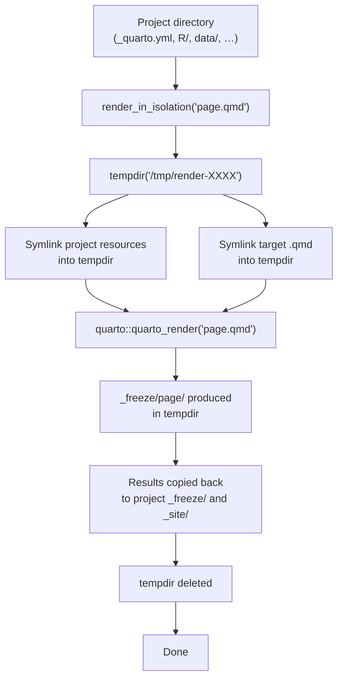

Quarto is amazing for the modern data science stack, where reproducible data science is treated as a first class citizen. But once the size of a project reaches a certain size, the performance completely flips the developer scientist's experience - waiting minutes for every change.

My context: two update streams hit the site. First, regular data refreshes (weekly, monthly) that mean specific pages need re-rendering. Second, new analyses that warrant brand new pages. Each page takes about 1 minute to render, and Quarto's serial render makes quick interactive development a pain. A dozen pages = 12 minutes of waiting. That bottleneck makes fast iteration impossible.

Some strategies and tips I've learned from managing a large Quarto website — 100+ pages of scientific analytics content, written in R.

## Iterating analyses in the form of .qmd files

`.qmd` files are like jupyter notebooks, code and it's output lives together alongside author-written narratives. the "`md`" part conveys that the filetype is "markdown" at heart, a simple lightweight human-readable document. The "`q`" standards for "Quarto", which today conveys a wide set of capabilities from languages supported (R, python, julia, observable js) and output file types. 

`.qmd`'s can be treated like functions, in that they can be parameterized, and "called" from other `.qmd`s using Quarto's "[includes](https://quarto.org/docs/authoring/includes.html)" shortcodes functionality. It's a really powerful way to generalize analysis to new datasets or to be run with different parameters. It enables the implementation of DRY principles in "analysis notebook" workflows. 

The problem with `includes` in quarto is that you can't parallelize rendering multiple documents that reference the same document. This issue stems from the principle that any quarto document cannot be rendered in parallel multiple times, due to overwritten intermediate files. 

 This issue and related issues has been raised before, and members of the quarto team are working on it, but the changes required are apparently complex. Unfortunately, for large quarto websites like some that I have been maintaining, this limitation represents a rather large bottleneck. Some days it feels like quarto, instead of enabling my data science workflows, feels like it's punishing me for choosing it as part of my stack. 

There are a few tips and tricks I've learned that make this manageable (for now, but I'm expecting our site to grow by easily an order of magnitude), which this post goes over.

## Turn on _freeze, orchestrate with r-targets


## The context

The site uses **templating** (basically trying to follow DRY principles). Root-level template files (e.g. `_template.qmd`) define shared structure, and individual pages include them via Quarto's `include` shortcode with parameter forwarding.

This keeps things DRY — one template, many pages. But it creates a dependency web: when the template changes, every page that includes it must re-render. When an upstream dataset changes, a specific subset of pages must re-render.

**Here's the trap:** when multiple pages all `include` the same master template `.qmd`, Quarto renders from that single source file and generates intermediate artifacts (`.knit.md`, `_freeze/` entries) in the *same* locations. Run those renders in parallel and each process overwrites the others' intermediate state mid-render — they clash and error out. Templates make freeze *less* useful (one edit invalids every dependent page) and parallelism *impossible* out of the box. The rest of this post is about escaping that trap.

## Freeze does the heavy lifting

Quarto's [`freeze` option](https://quarto.org/docs/projects/code-execution.html#freeze) saves computations in `_freeze/` and reuses them on subsequent renders. Pages whose source hasn't changed skip re-execution entirely. This is the single biggest performance win — turning a full-site render from "re-run everything" to "re-run only what changed."

But there's a catch: **Quarto renders serially.** [Quarto Discussions #2749](https://github.com/orgs/quarto-dev/discussions/2749) confirms parallel rendering isn't natively supported yet. So even with freeze avoiding recomputation, 50 pages × ~1 minute each still adds up.

## The obvious answer: parallelize

Parallelizing renders is an obvious solution — and it works well out of the box with `{furrr}`:

```r
library(furrr)
plan(multisession, workers = 4)

pages <- c("reports/page1.qmd", "reports/page2.qmd", "reports/page3.qmd")
future_walk(pages, ~ quarto::quarto_render(.x))
```

But... it fails when multiple `.qmd` files share a template. Each `quarto render` process writes to intermediate files — `.knit.md`, `_freeze/`, and other temporary artifacts. When multiple renders include the same template `.qmd` simultaneously via Quarto shortcodes, they all write to the same intermediate files, overwriting each other's state and producing corrupted output or cryptic errors like:

```
Error in readLines(con, warn = FALSE) : cannot open the connection
```

This is a **known concurrency bug**, tracked in [Quarto CLI #5861](https://github.com/quarto-dev/quarto-cli/issues/5861) and [#4730](https://github.com/quarto-dev/quarto-cli/issues/4730), with no official fix yet.

### Why the workaround of renaming temp files doesn't work for websites

One community workaround (from [@mschubert](https://github.com/quarto-dev/quarto-cli/issues/4730#issuecomment-1469364296)) symlinks the `.qmd` under a unique name, renders that, then cleans up:

```bash
ln -s template.qmd page_A.qmd
quarto render page_A.qmd -P counter:1 --output page_A.html
unlink page_A.qmd
```

Unfortunately this works for standalone parameterized reports, but **breaks in a Quarto website project** because website output lands in a shared `_site/` directory. Multiple parallel renders to `_site/` produce the same race condition just one level deeper. It also doesn't handle the project-level dependencies those renders need: `_quarto.yml`, `.Rprofile`, `renv/`, `R/` helper functions, and shared data.

## The solution: `render_in_isolation()`

The core idea is simple: for each `.qmd` you want to render, create a fresh tempdir, symlink in the project resources it needs, render inside that sandbox, and copy the results back. My solution — which disclaimer, I asked Claude to help generate — can be found in [`render_in_isolation.R`](render_in_isolation.R).



Here's how to use it:

```r
source("posts/2026-06-11/render_in_isolation.R")

render_in_isolation("reports/q4-summary.qmd")
```

Paired with `{targets}`, the fix is a one-line change:

```r
library(targets)
source("render_in_isolation.R")

list(
  tar_target(
    pages,
    c("reports/page1.qmd", "reports/page2.qmd", "reports/page3.qmd")
  ),
  tar_target(
    rendered,
    render_in_isolation(pages),
    pattern = map(pages)
  )
)
```

`pattern = map(pages)` tells `{targets}` to branch and render each file in parallel — but now each branch runs in its own tempdir, so the race condition disappears.

## How it works under the hood

The full source is in [`render_in_isolation.R`](render_in_isolation.R). Here are the key pieces.

### The core function

```r
render_in_isolation <- function(qmd_path, project_dir = ".", 
                                symlinks = NULL, keep_failed = FALSE, ...) {
  project_dir <- fs::path_abs(project_dir)
  tempdir_path <- tempfile("render-", tmpdir = "/tmp")
  dir.create(tempdir_path)
  render_ok <- FALSE
  start <- Sys.time()
  
  on.exit({
    if (!render_ok && keep_failed) return()
    if (fs::dir_exists(tempdir_path)) fs::dir_delete(tempdir_path)
  }, add = TRUE)
  
  # Symlink project resources and template files into the sandbox
  links <- c(DEFAULT_SYMLINKS, 
    list.files(project_dir, pattern = "^_.*\\.(qmd|Rmd)$", full.names = FALSE))
  for (link in links) {
    src <- fs::path(project_dir, link)
    if (fs::file_exists(src) || fs::dir_exists(src)) {
      fs::link_create(fs::path_abs(src), fs::path(tempdir_path, link))
    }
  }
  
  # Render inside the sandbox
  original_wd <- getwd()
  setwd(tempdir_path)
  on.exit(setwd(original_wd), add = TRUE)
  
  result <- tryCatch({
    quarto::quarto_render(fs::path(project_dir, qmd_path), ...)
    
    # Copy freeze and output back to real project
    qmd_no_ext <- sub("\\.qmd$", "", qmd_path)
    freeze_src <- fs::path(tempdir_path, "_freeze", qmd_no_ext)
    freeze_dest <- fs::path(project_dir, "_freeze", qmd_no_ext)
    if (fs::dir_exists(freeze_dest)) fs::dir_delete(freeze_dest)
    fs::dir_create(fs::path_dir(freeze_dest), recurse = TRUE)
    fs::dir_copy(freeze_src, freeze_dest)
    
    # Copy rendered HTML and associated _files/ from _site/
    html_name <- paste0(qmd_no_ext, ".html")
    html_src <- fs::path(tempdir_path, "_site", html_name)
    files_src <- fs::path(tempdir_path, "_site", paste0(qmd_no_ext, "_files"))
    if (fs::file_exists(html_src)) {
      fs::file_copy(html_src, fs::path(project_dir, "_site", html_name), overwrite = TRUE)
    }
    if (fs::dir_exists(files_src)) {
      files_dest <- fs::path(project_dir, "_site", paste0(qmd_no_ext, "_files"))
      if (fs::dir_exists(files_dest)) fs::dir_delete(files_dest)
      fs::dir_copy(files_src, files_dest)
    }
    
    render_ok <<- TRUE
  }, error = function(e) e)
  
  list(
    qmd = qmd_path,
    success = render_ok,
    error = if (render_ok) NULL else result$message,
    duration_sec = as.numeric(difftime(Sys.time(), start, units = "secs"))
  )
}
```

Three principles drive the design:

### Symlinking project resources

The function populates a tempdir with symbolic links to everything a Quarto render might need:

```r
DEFAULT_SYMLINKS <- c(
  "_quarto.yml",
  "_brand.yml",
  ".Rprofile",
  "R",
  "DESCRIPTION",
  "NAMESPACE",
  "renv",
  "renv.lock",
  "brand",
  "data",
  "includes",
  "img",
  "figures",
  "figure",
  "styles.css",
  "scripts",
  "references.bib"
)
```

It also auto-detects root-level `_*.qmd` and `_*.Rmd` template files, plus any sibling templates in the target's directory. Missing paths are silently skipped.

**Why symlinks instead of copies?** Two reasons: speed (symlink creation is instantaneous regardless of file size — copying a `data/` directory with gigabytes of CSVs would dominate render time) and no duplication (N parallel renders all point to the same physical files). Symlinks are also read-only from the sandbox's perspective — the render never modifies the originals.

### Freeze and output management

After `quarto::quarto_render()` completes, the function copies `_freeze/<page>/` and the rendered HTML (from the tempdir's `_site/`) back into the real project. This is what makes `freeze: true` work across parallel renders — each page's freeze data arrives back to the right place without conflicts.

### Error handling

The function returns a list with `$success`, `$error`, and `$duration_sec`. With `keep_failed = TRUE`, the tempdir is preserved for debugging. Crucially, tempdirs are created in `/tmp` (not R's session temp), so they survive the R process exiting.

## One more speed tip: serve with Caddy instead of `quarto preview`

During interactive development, `quarto preview` tries to be too fancy — re-rendering, re-building listings, re-processing cross-references — and it's slow. A much faster alternative: render with `quarto render`, then serve the `_site/` directory directly with [Caddy](https://caddyserver.com/):

```bash
# In your project directory
caddy file-server --listen :4210 --root _site
```

Now you're serving raw HTML files with zero overhead. When you change something, re-render the specific file and the browser refresh is near-instant. Combined with `render_in_isolation()`, you can re-render a single page in isolation and immediately see the result — no full site rebuild needed. If these strategies are employed, development speed for new pages and page updates goes way way faster.

## CI/CD

Lastly, even with per-page parallelism, site-wide renders are still slow (~1–3 seconds per page even with _freeze = 100+ seconds for 100 pages). This friction can be minimized with your CI/CD system of choice (e.g. GitHub Actions, private runners):

```yaml
# .github/workflows/publish.yml
quarto render  # runs on push, deploys to gh-pages
```

With freeze checked into version control, CI only executes pages whose source changed. Combined with isolated parallel renders for pages that *do* need updating, site rebuilds become fast enough to not care about.

## References

- [Quarto — Managing Execution (freeze)](https://quarto.org/docs/projects/code-execution.html#freeze)
- [The targets R package](https://books.ropensci.org/targets/) (Landau, 2021. JOSS 6(57): 2959)
- [Quarto Discussions #2749](https://github.com/orgs/quarto-dev/discussions/2749) — Parallel rendering feature request.
- [Quarto CLI #5861](https://github.com/quarto-dev/quarto-cli/issues/5861) — HPC parallel render bug.
- [Quarto CLI #4730](https://github.com/quarto-dev/quarto-cli/issues/4730) — Parameterized parallel report conflicts.

