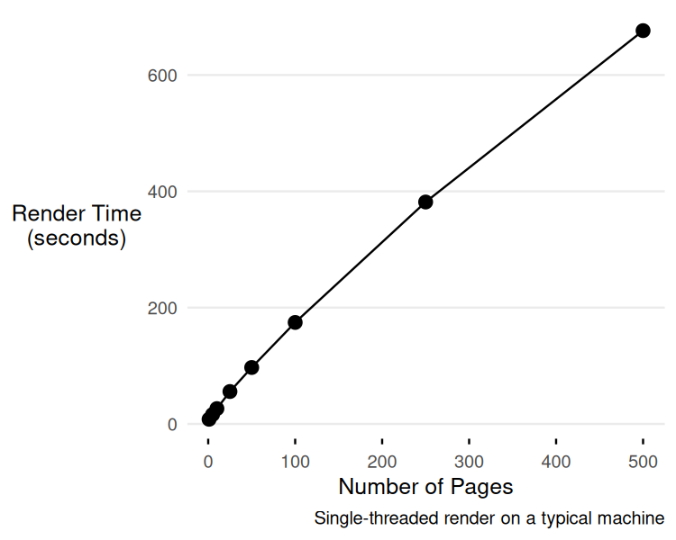

Quarto has slowly become one of my daily tools as a data scientist. Pretty much any analytical task involving data analysis, I turn to Quarto instead of Jupyter notebooks or R Markdown. More than that, Quarto isn't just for "notebook" analysis; it can also be used to create wiki-like websites with analytical content. Quarto is designed exactly for this kind of product, enabling reproducibility and integration with Python, R, JavaScript, and HTML/CSS.

::: {.columns}

:::{.column width="50%"}

Quarto has made my life much easier in a lot of ways, *but because I use it so much, I also spend a lot of time fighting it*, specifically around limitations in scalability and performance. This post is an *in-the-weeds* experience about those limitations and some of the strategies I've been using to work around them.

This isn't an unknown problem. Others have discussed the same performance issues [@quarto-perf-2024; @mackinlay-quarto], and the Quarto team is aware and seems to be planning some significant performance-related upgrades [@quarto-roadmap-2026]. Crossing my fingers these issues become irrelevant soon.

:::

:::{.column width="50%"}

{#fig-render-time}

:::

:::

## Quarto for a large >100 page scientific website

I manage a project that involves creating and updating webpages on a Quarto website with close to 100 pages of analytical documents. "Document" here refers to a `.qmd`[^1] that programmatically (through R, Python, and/or JavaScript) analyzes data and generates outputs like graphs and figures that live alongside narrative text -- a perfect use case for Quarto. Two types of events prompt site updates:

- Regular data refreshes (weekly, monthly) trigger targeted re-rendering of downstream pages.
- New scientific questions require new dedicated webpages for their associated analyses to live in.

Each page takes about 20 seconds to 1 minute to render. The total time to render the whole site is **10-20 minutes**, and is expected to at least double in the next year. This is a significant bottleneck in the workflow: render time now requires real consideration when planning updates.

[^1]: `.qmd` files are like Jupyter notebooks: code and its output live together alongside author-written narrative. The "`md`" part conveys that the filetype is markdown at heart, a simple, lightweight, human-readable document. The "`q`" stands for "Quarto," which today spans a wide set of capabilities across supported languages (R, Python, Julia, Observable JS) and output formats.

## Slowness with quarto render

Slowness stems from the fact that Quarto renders documents serially and can't be parallelized, due to concurrency problems [@quarto-perf-2024]. A few GitHub issues describe some bespoke solutions[^2], but none are generalizable enough. Specifically, they don't work for me for two reasons: the solutions target standalone HTML documents rather than a full website, and I rely on [`includes`](https://quarto.org/docs/authoring/includes.html) [@quarto-includes-docs] to keep my website DRY[^3], which brings its own complications for parallelization.

[^2]: @quarto-concurrency-hpc and @quarto-concurrency-param describe concurrency issues, with some members suggesting workarounds, but with no official fix from Quarto yet.

[^3]: The DRY (Don't Repeat Yourself) principle is a core software development philosophy stating that "every piece of knowledge must have a single, unambiguous, authoritative representation within a system".

### Why `includes` complicates parallel rendering

A `.qmd` document can be treated like a function: parameterized and reused as a shared component that other `.qmd` documents call into. For example, I might have a `penguins.qmd` that analyzes penguin body measurements, and a series of per-species documents that each include `penguins.qmd`, passing in a different species as a parameter.

This is a great way to follow DRY principles in an "analysis notebook" workflow: write the analysis once, reuse it across many pages. But it comes at a cost for parallelization. Rendering a `.qmd` produces intermediate files during the render process. When two documents that both include the same shared `.qmd` render at the same time, their intermediate state collides: each process overwrites the other's files mid-render, and both renders error out.

One community [workaround](https://github.com/quarto-dev/quarto-cli/issues/4730#issuecomment-1469364296)) symlinks the `.qmd` under a unique name, renders that, then cleans up:

```bash
ln -s template.qmd page_A.qmd
quarto render page_A.qmd -P counter:1 --output page_A.html
unlink page_A.qmd
```

Though this works for standalone parameterized reports, it breaks in a Quarto website project because the output lands in a shared `_site/` directory. It also doesn't handle the project-level dependencies those renders need: `_quarto.yml`, `.Rprofile`, `renv/`, `R/` helper functions, and shared data. The following `render_in_isolation` function tries to address these issues to allow parallel rendering for Quarto websites.

## `render_in_isolation()`

The idea is: for each `.qmd` you want to render, create a fresh tempdir, symlink in the project resources it needs, render inside that sandbox, and copy the results back.

```{mermaid}
flowchart TD
    A["Project directory<br/>(_quarto.yml, R/, data/, …)"]
    B["render_in_isolation('page.qmd')"]
    C["tempdir('/tmp/render-XXXX')"]
    D["Symlink project resources<br/>into tempdir"]
    E["Symlink target .qmd<br/>into tempdir"]
    F["quarto::quarto_render('page.qmd')"]
    G["_freeze/page/ produced<br/>in tempdir"]
    H["Results copied back<br/>to project _freeze/ and _site/"]
    I["tempdir deleted"]
    J["Done"]

    A --> B
    B --> C
    C --> D
    C --> E
    D --> F
    E --> F
    F --> G
    G --> H
    H --> I
    I --> J
```

Here I show pairing with `{targets}` to run in parallel:

```r
library(targets)
source("render_in_isolation.R")

list(
  tar_target(
    pages,
    c("reports/page1.qmd", "reports/page2.qmd", "reports/page3.qmd")
  ),
  tar_target(
    rendered,
    render_in_isolation(pages), # instead of quarto::render
    pattern = map(pages)
  )
)
```

The full source is in [`render_in_isolation.R`](render_in_isolation.R). Here are the key pieces.

### The main logic

```{r}
#| code-fold: true
render_in_isolation <- function(
  qmd_path,
  project_dir = ".",
  symlinks = NULL,
  keep_failed = FALSE,
  output_dir = "_site",
  ...
) {
  start <- Sys.time()
  project_dir <- fs::path_abs(project_dir)
  tempdir_path <- tempfile("render-", tmpdir = "/tmp")
  fs::dir_create(tempdir_path)

  render_ok <- FALSE
  original_wd <- getwd()

  on.exit(
    {
      setwd(original_wd)
      if (fs::dir_exists(tempdir_path) && !(keep_failed && !render_ok)) {
        fs::dir_delete(tempdir_path)
      }
    },
    add = TRUE
  )

  links <- if (is.null(symlinks)) DEFAULT_SYMLINKS else symlinks
  links <- c(links, list_root_templates(project_dir))

  # Sibling "_*" files next to the target qmd (e.g. a shared template used
  # via includes) also need to be symlinked in. A missing qmd_dir is reported
  # as a normal render failure below rather than crashing here.
  qmd_dir <- fs::path_dir(qmd_path)
  if (qmd_dir != ".") {
    qmd_dir_files <- tryCatch(
      fs::dir_ls(fs::path(project_dir, qmd_dir), type = "file", all = FALSE),
      error = function(e) character(0)
    )
    for (file_path in qmd_dir_files) {
      file_name <- fs::path_file(file_path)
      if (startsWith(file_name, "_")) {
        links <- c(links, fs::path(qmd_dir, file_name))
      }
    }
  }

  # The render target itself may already be one of the underscore-prefixed
  # templates symlinked above; dedupe so it's only linked once.
  links <- unique(links)
  links <- links[links != qmd_path]
  for (link in links) {
    symlink_if_exists(link, project_dir, tempdir_path)
  }

  setwd(tempdir_path)

  result <- tryCatch(
    {
      target_src <- fs::path(project_dir, qmd_path)
      if (!fs::file_exists(target_src)) {
        cli::cli_abort("Target qmd does not exist: {.path {target_src}}")
      }
      target_dest <- fs::path(tempdir_path, qmd_path)
      fs::dir_create(fs::path_dir(target_dest), recurse = TRUE)
      if (fs::link_exists(target_dest)) {
        fs::file_delete(target_dest)
      }
      fs::link_create(fs::path_abs(target_src), target_dest)

      quarto::quarto_render(qmd_path, ...)
      copy_freeze_back(qmd_path, tempdir_path, project_dir)
      copy_output_back(qmd_path, tempdir_path, project_dir, output_dir)
      list(error = NULL, success = TRUE)
    },
    error = function(e) list(error = conditionMessage(e), success = FALSE)
  )
  render_ok <- isTRUE(result$success)

  list(
    qmd = qmd_path,
    success = result$success,
    error = result$error,
    tempdir = if (keep_failed && !result$success) tempdir_path else NULL,
    duration_sec = as.numeric(difftime(Sys.time(), start, units = "secs"))
  )
}
```

Three principles drive the design:

### Symlinking project resources

The function populates a tempdir with symbolic links to everything a Quarto render might need:

```r
DEFAULT_SYMLINKS <- c(
  "_quarto.yml",
  "_brand.yml",
  ".Rprofile",
  "R",
  "DESCRIPTION",
  "NAMESPACE",
  "renv",
  "renv.lock",
  "brand",
  "data",
  "includes",
  "img",
  "figures",
  "figure",
  "styles.css",
  "scripts",
  "references.bib"
)

```

::: {.callout-note}
This is a non-exhaustive list of resources that I needed for my own website - add more as needed
:::

It also auto-detects any underscore-prefixed file at the project root (`_metadata.yml`, `_page_template.qmd`, etc.) and any sibling underscore-prefixed files sitting next to the target `.qmd`. This is the piece that actually solves the `includes` problem from earlier: when `species-A.qmd` and `species-B.qmd` both include the shared `penguins.qmd`, each gets its own symlinked copy of `penguins.qmd` in its own sandboxed tempdir, so their intermediate render state can never collide. Missing paths are silently skipped, and if the render target itself happens to be one of the auto-detected templates, it's only linked once.

### Freeze and output management

After `quarto::quarto_render()` completes, the function copies `_freeze/<page>/` and the rendered HTML (from the tempdir's `_site/`) back into the real project. This is what makes `freeze: true` work across parallel renders — each page's freeze data arrives back to the right place without conflicts.

### Error handling

The function returns a list with `$success`, `$error`, `$tempdir`, and `$duration_sec`. With `keep_failed = TRUE`, the tempdir is preserved for debugging and its path is returned in `$tempdir`. Temp directories are created in `/tmp` (not R's session temp), so they survive the R process exiting.

## Other performance tips

- `freeze` helps a lot, but it only covers computation. Quarto still spends a lot of time rendering (1-2s per page adds up when you have 100+ pages).
- That said, sharing freeze artifacts via git (Quarto's own suggestion) quickly becomes unwieldy -- Once my `.git/` folder grew to 2 gb, I decided to stop tracking `_freeze` files. I recommend sharing them through some other mechanism.
- Use CI/CD (e.g. GitHub Actions) to handle full site renders.
- Serving the `_site` directory directly and running `quarto render [PAGE]` from the CLI is much faster than `quarto preview`. This speeds up the development loop; it's not relevant for production rendering.

```bash
# In your project directory
caddy file-server --listen :4210 --root _site
```

## References
