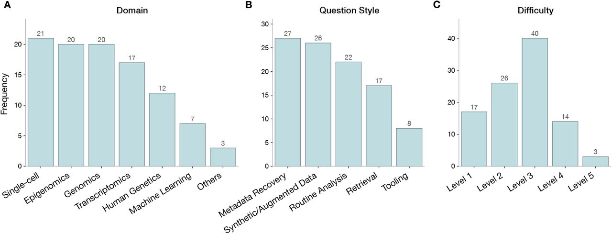

<!---
Intro

Meat

Conclusions

--->

When new LLM models are released, they are always published with some measureable increase in performance. Performance, however, is extremely hard to measure when it comes to complex every day tasks. In bionformatics, how do you measure how well a new model performs?

Recently, some big names have released LLM benchmarks for measuring performance on bioinformatics and computational biology tasks. [CompBioBench](https://www.biorxiv.org/content/10.64898/2026.04.06.716850v1) was released by the pharma giant Genentech on April ..., which was closely followed by Anthropic releasing their own BioMysteryBench. 

Here in this post I looked at some of the questions and evaluations in these benchmarks and share some thoughts about the quality, relevance, and what it all means for Bioinformatics as a field in this age of AI. 

# Transparency

First difference worth talking about is that Genentech published their benchmark on biorxiv, which is a very common preprint journal in the bioinformatics field. Their benchmark, problem statement, and results are presented in standard scientific article format. This means, everything is deeply documented. And, the article itself is hosted by biorxiv, which is a non-affiliated organization, that will retain this original published version and also handle author-submitted updates.

This is in contrast to Anthropic's approach, which was to write a blog post. In contrast, the blog post is scant on details about how they created the benchmark, the questions and the answers. There's a lack of depth and clarity in the whole thing that is stark in contrast to CompBioBench. The blog post is *nice to read*, the writing is good, and engagin, and the content is bolstered through some nice images and examples. But it's not transparent. At any time, Anthropic can change the content of the blog post, there's no real process for tracking "updates", and versioning. 

Both benchmarks publish data onto hugginface, the industry standard platform for all LLM benchmarks. So there is some versionoing documentation and transparency and reproducible from that. But overall, I found it much harder to find details on Anthropic's approach.

An example of this was that, upon only opening the questions dataset from Anthropic's BioMysteryBench, did I realize that they are using LLM as a judge. The evaluations read like this:

"Score 1 if the answer is 'GENE A', score 0 if the model CHEATED or if provided a wrong answer". 

So actually, there is some reliance on an LLM evaluating the answers, which LLm is provided in what environment, I don't know. How reliable are LLM judges in general? I don't know either. I think this is probably reasonable approach, and the results are likely not severely impacted by this approach, but it's opaque.

In contrast, the questions from CompBioBench rely on providing an EXACT answer in a specified format,

>subtype.inflammation.q1.1.mtx.gz and subtype.inflammation.q1.2.mtx.gz contain raw scRNA counts matrices from retinal samples from two eyes of an individual (one per file, each column is a unique barcode that passes QC). subtype.inflammation.q1.genes.txt.gz is the list of common genes. One of the cell types is inflamed in one eye compared to the other. What is this cell type? Return only the name of the inflamed cell type from this list: astrocyte, microglial cell, RPE cell, cone cell, rod cell, horizontal cell, bipolar cell, RGC, T cells, macrophage, Schwann cell, Pericyte, B cell, fibroblast, muller glia cell, endothelial cell.

So it's essentially a multiple choice question, and the evaluation can be carried with a simple deterministic X == Y check. 


# Types of questions

Both benchmarks have 100 question/answer pairs in their benchmark. The 

Similarities between CompBioBench and BioMysteryBench:

- Both have a ground truth binary outcome for each task
- Both distinguish between less and more difficult tasks
    - CBB has a difficulty scale of 1-5, though this seems to be missing from their published dataset
    - BMB has a binary "human-solvable" (True/False) indicator

Bioinformatics is a huge field, what domains, data types are covered?



For Anthropic, this is the only published mention of their questions break down:

> In developing this eval, questions were primarily derived from raw or minimally processed DNA or RNA sequencing data since this is where many biological processing pipelines begin (WGS, scRNA-seq, methylation, ChIP-seq, metagenomics, Hi-C), and also included several questions drawn from proteomics and metabolomics.

No such breakdown was published, so I had claude classify all 90 BioMysteryBench questions into the same cateogiese for *Domain* and *Question Style* categories CompBioBench used, to make the two directly comparable.

```{ojs}
benchmarkData = FileAttachment("benchmark-comparison.csv").csv({typed: true})
```

```{ojs}
domainOrder = ["Single-cell", "Epigenomics", "Genomics", "Transcriptomics", "Human Genetics", "Machine Learning", "Others"]
styleOrder = ["Metadata Recovery", "Synthetic/Augmented Data", "Routine Analysis", "Retrieval", "Tooling"]
benchmarkOrder = ["CompBioBench", "BioMysteryBench"]
benchmarkColor = ({ domain: benchmarkOrder, range: ["#4c78a8", "#b7d6d6"] })

function benchmarkChart(categoryType, order) {
  const chartData = benchmarkData.filter(d => d.category_type === categoryType)
  return Plot.plot({
    width: 680,
    height: order.length * 34 + 40,
    marginLeft: 200,
    marginRight: 50,
    style: { background: "transparent", fontSize: "13px" },
    fx: { domain: benchmarkOrder, label: null },
    y: { domain: order, label: null },
    x: { label: "Number of questions", grid: true },
    color: benchmarkColor,
    marks: [
      Plot.barX(chartData, { x: "count", y: "category", fx: "benchmark", fill: "benchmark" }),
      Plot.text(chartData, { x: "count", y: "category", fx: "benchmark", text: d => d.count, dx: 16 }),
      Plot.tip(chartData, Plot.pointerY({
        x: "count",
        y: "category",
        fx: "benchmark",
        title: d => `${d.benchmark}\n${d.category}: ${d.count} questions (${d.pct}%)`
      })),
      Plot.ruleX([0])
    ]
  })
}
```

```{ojs}
html`<div style="font-weight: 600; margin: 0.5rem 0 0.25rem;">Domain</div>${benchmarkChart("Domain", domainOrder)}`
```

```{ojs}
html`<div style="font-weight: 600; margin: 1rem 0 0.25rem;">Question Style</div>${benchmarkChart("Question Style", styleOrder)}`
```

Some interesting observations:

- BioMysteryBench only has **one** single cell RNAseq question! A very questionable design because this is one of the leading assays in the last decade. 

- The large majority of BioMysteryBench's questions (78%) are metadata recovery: "here is an anonymized dataset, figure out what it is." Fewer of BioMysteryBench's questions ask the model to actually run an analysis or look something up in a database.

- BioMysteryBench covers proteomics and microbial genomics, whereas CompBioBench doesn't

- BioMysteryBench covers more heavily on bulk RNAseq, which is probably reflective of the bulk of day-to-day work due to the assays accesibility, low cost, and abundance of high quality public / open source datasets.

Both omit spatial scRNAseq, which is an increasingly popular novel assay these days. It makes sense for perhaps the first iterations to benchmark against more common validated assays, and later tackle novel technologies separately.

# How difficult are these benchmarks?

*Is AI coming for your job* I think this depends on the level of complexity AI is able to handle. So I looked at how difficult the most difficult questions were in these benchmarks. Here is a sample from both BioMysteryBench and CompBioBench.

BioMysteryBench has 17 questions at a difficulty of 4-5 out of 5.

CompBioBench has 17 "human-unsolvable" questions [^unsolvable].

[^unsolvable]: In *the blog post* Anthropic actually refers to these as "Human difficult" questions, but in the benchmark dataset, they are described as not solvable. The original set also describes 23 problems, which on a recent update, several were removed and left with 17. 

> This microarray dataset contains expression data from various ovarian and pancreatic cancer biopsies ran on GPL 887 and GPL 4133 platforms, respectively. Based on the expression profile of each sample, assign a sex (male, female, or unknown) to each sample. The final output should be in the format of “Sample; sex” (eg Sample 1; male)

2 files are provided: one .csv with genes in columns (RefSeq IDs) and samples in rows. The second file is a mapping between the REFSEQ ID and gene symbol (e.g. NM_0000 = RPL23). The second file seems unnecssary as in these tasks the LLM is given access to databases and mapping transcript / gene identifiers to common gene names is a relatively simple routine task. 

The task is rather straightforward -> identify the sex identity of samples based on mixed tissue expression profiles. First, I would check if any genes map to X chromosomes. A PCA + any unsupervised clustering algorithm may be sufficient in separating male and female. But because they are mixed tissue, it may be necessary to identify the tissue identity first. I would try PCA + clustering on the entire dataset, which the primary driver variation (PC1 & 2) should separate by tissue. If a clear separation exists, I would apply the x-chromosome gene-specific clustering separately in each tissue.

The other more involved approach would be to look for and ingest reference datasets of the same tissues, and use those to confirm and map tissue identity. TCGA likely has coverage here. One could look to see if there is a few genes 


# Summary

LLMs are extremely capable, able to do fairly complex analyses much faster than human. This is supported by the results from existing benchmarks, demonstrating human-like performance on common bioinformatics tasks.

Benchmarks are wildly different, some evaluate process / trajectory / reasoning. Others like CompBioBench and BioMysteryBench evaluate on outcomes and provide objective verifiable truths. Some Benchmarks (e.g. BiomniBench) use LLM as judge.

Many benchmarks hire "experts" with advanced degrees, or multiple year experience, to generate training and evaluation content. Looking at Anthropic's "unsolvable by human" questions makes me question the quality of some of these question/answers, as many I found very trivially easy to solve. I think the branding of "difficulty" for anthropic is likely more of a marketing strategy - look at what our fancy model can do that even humans can't do!

LLMs are for sure making bioinformatics more accessible, but you still need a human to steer the ship, and the better the captain, the better output from the LLM.

So in conclusion, no I don't think AI can replace us bioinformaticians / data scientists (yet). Today the LLM is a productivity multiplier by speeding up specific processed. I can port my R package into python, or speed it with a Rust-backend, but the question is, is it worth the time, or is my effort better spent somewhere else? 