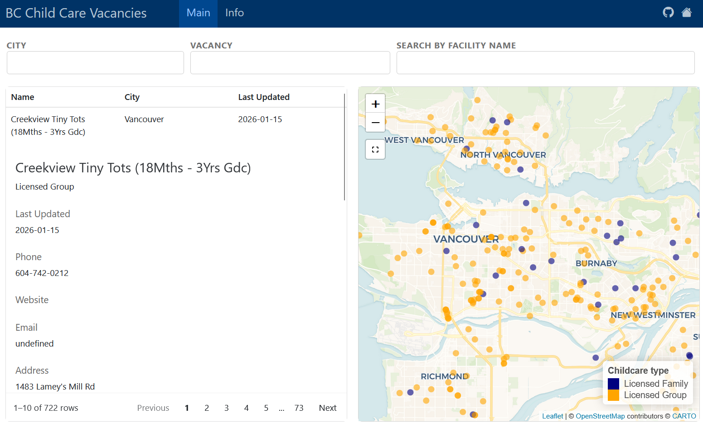

This project pulls publicly available Government of BC's Child Care Vacancies to identify up-to-date child care vacancy across the province.

The implementation is an automated data pipeline that ingests a publicly available open data endpoint that refreshes daily, processes vacancy information, and distributes results through two public-facing channels:

1. An interactive web dashboard that allows users to browse current vacancies in a centralized, accessible format.

2. Automated social media reporting via a Mastodon bot that posts newly available child care vacancies.

::: {.callout-note}
Note the Mastodon bot has been decommisioned due to the [closure of the `bots.in.space` server in 2025](https://news.ycombinator.com/item?id=41989511).
:::

The goal of this project was to deliver these resources while minimizing overhead and maintenance. Which leads to tech choice:

The pipeline is orchestrated using GitHub Actions (free), enabling scheduled data retrieval, validation, transformation, and deployment without manual intervention. This ensures that published information remains current, reliable, and reproducible.

# Dashboard

- [Dashboard](https://victoryuan.com/bcchildcarebot)
- [source](https://github.com/wvictor14/bcchildcarebot)

# Mastodon bot

Last updated: 2024-06-09

- [Blog post for the bot](/posts/2024-06-12-making-a-twitter-bot-in-the-year-2024)
- [Mastodon bot](https://botsin.space/@bcchildcarebot) 
- [source](https://github.com/wvictor14/bcchildcarebot)

# Tools & Technology

- GitHub Actions – orchestrates the automated pipeline, including daily data retrieval, validation, transformation, and deployment.

- Open Data Integration – ingests daily-updated CSV datasets from the Government of British Columbia, ensuring reliable, up-to-date information.

- Web Dashboard – built using Quarto and R to provide an interactive, accessible interface for end users.

- Social Media Automation – Mastodon bot (decommissioned) demonstrated automated content delivery and engagement.

- Version Control & Reproducibility – all source code and workflow managed with GitHub, supporting transparent and maintainable operations.

- Automation & Scheduling – minimal manual intervention required; system designed for longevity and low-maintenance operation.
