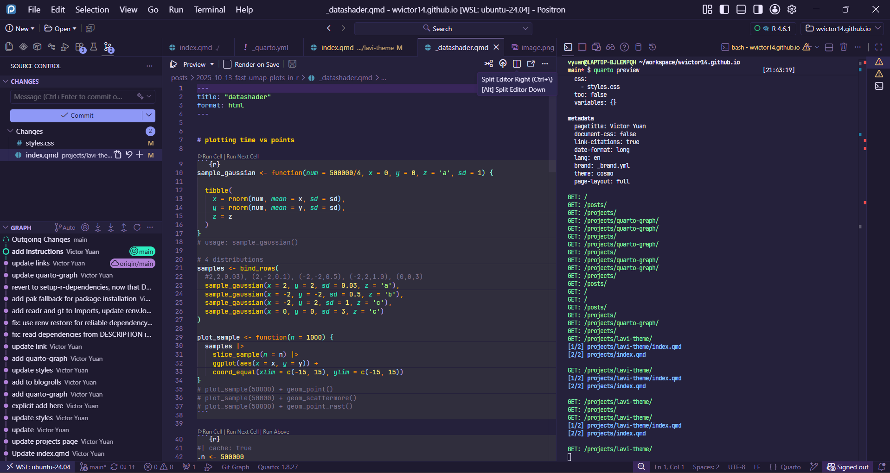

Repo here: [wvictor14/lavi-positron-theme](https://github.com/wvictor14/lavi-positron-theme)

You can find the theme by searching "Lavi" in Positron's extensions marketplace.

Credit to [b0o/lavi 🪻](https://github.com/b0o/lavi) for inspiration and source tmTheme files.

